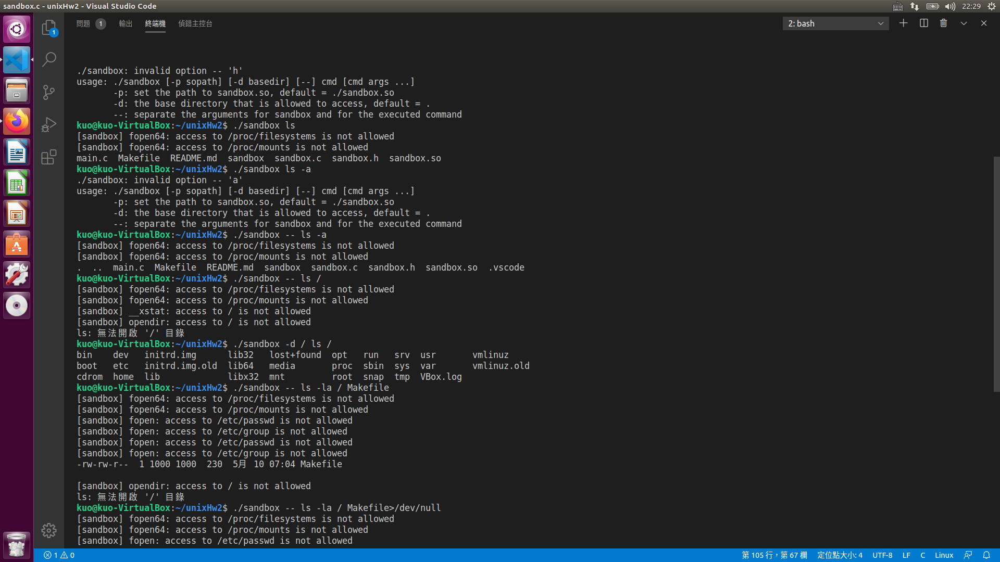
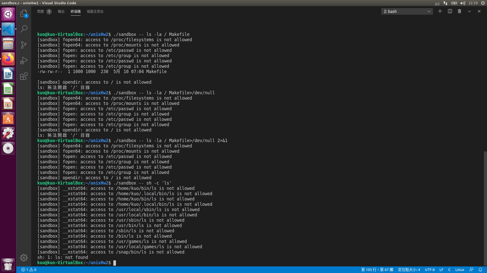

# HW2 SandBox

* [使用方式](#使用方式)
    - [編譯](#編譯)
    - [執行](#執行)
    - [清理](#清理)
* [函式劫持](#函式劫持)
* [執行結果](#執行結果)

---

## 使用方式

### 編譯

```zsh
make
```

### 執行

```
./sandbox [-p sopath] [-d basedir] [--] cmd [cmd args ...]
-p: set the path to sandbox.so, default = ./sandbox.so
-d: the base directory that is allowed to access, default = .
--: separate the arguments for sandbox and for the executed command
```


### 清理

```zsh
make clean
```


## 函式劫持

```c
//arg1
int chdir(const char *path);
int remove(const char *filename)
int unlink(const char *pathname);
int rmdir(const char *path);
DIR *opendir(const char *name);

//arg2
FILE *fopen(const char *filename, const char *mode)
FILE *fopen64(const char *filename, const char *mode)
int open(const char *pathname, int flags);
int open64(const char *pathname, int flags);
int creat(const char *path, mode_t mode);
int creat64(const char *path, mode_t mode);
int mkdir(const char *   path, mode_t mode);
int chmod(const char *  pathname, mode_t mode);
int rename(const char *old, const char *new);
int symlink(const char *path1, const char *path2);
int link(const char *   path1, const char *path2);

// arg3
int chown(const char *path, uid_t owner, gid_t group);
ssize_t readlink(const char *path, char *buf, size_t bufsiz);
int __xstat(int ver, const char * path, struct stat * stat_buf);
int __xstat64(int ver, const char * path, struct stat64 * stat_buf);

//arg4
int openat(int dirfd, const char *pathname, int flags,mode_t mode)
int openat64(int dirfd, const char *pathname, int flags,mode_t mode)

//exec
int execl(const char *path, const char *arg, ...);
int execlp(const char *file, const char *arg, ...);
int execle (const char *__path, const char *__arg, ...)
int execv(const char *path, char *const argv[]);
int execvp(const char *file, char *const argv[]);
int system(const char *command)
int execve(const char *pathname, char *const argv[],char *const envp[]);
```

## 執行結果




